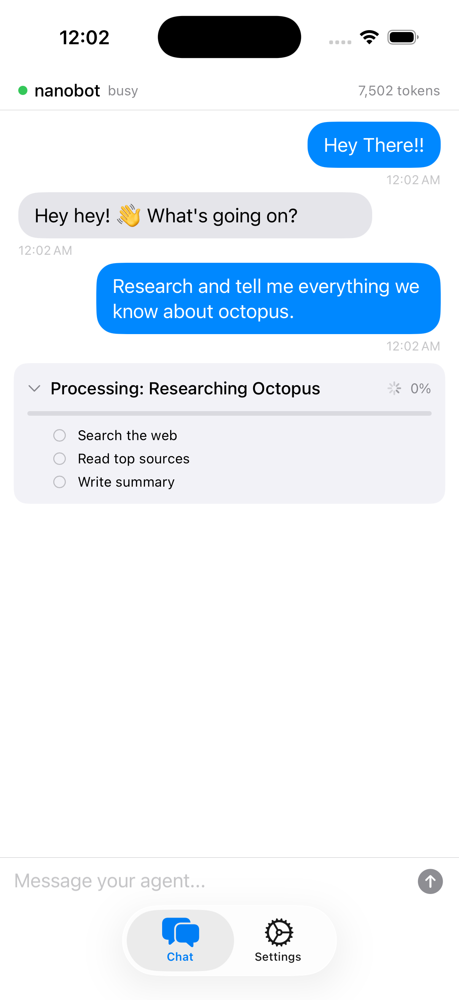
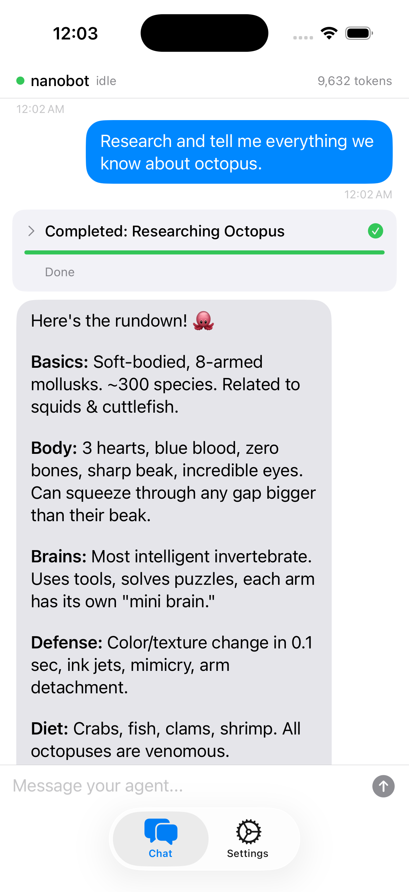

# Window

Open-source iOS client for personal AI agents. Built with SwiftUI.

Window gives you a native chat interface with live visibility into what your agent is doing — without relying on Telegram or centralized platforms. Connect to any [nanobot](https://github.com/HKUDS/nanobot) agent running on your VPS, home server, or local machine.

<p>
  
  
</p>

## Features

- **Real-time task visibility** — see live progress cards when your agent performs multi-step work (research, file ops, etc.). The agent decides when to show task cards; simple replies don't clutter the UI.
- **Token tracking** — live prompt token count from each LLM response, so you always know how much context your conversation is consuming.
- **Credential persistence** — API key stored in Keychain, host in UserDefaults. Auto-reconnects on app launch.
- **Health monitoring** — green/red reachability dot with polling every 10s. Auto-retry on WebSocket disconnect.
- **Unified timeline** — messages and task cards interleaved in a single scrollable chat view.
- **Custom markdown rendering** — headings, bold/italic, code blocks, lists, and links in compact chat bubbles.
- **Demo mode** — try the app UX without a server.
- **Decentralized** — connect to any IP where your agent lives. No central server.

## Server Setup

Window connects to any [nanobot](https://github.com/HKUDS/nanobot) instance with the Window channel enabled. Add this to your nanobot `config.json`:

```json
{
  "channels": {
    "window": {
      "enabled": true,
      "host": "0.0.0.0",
      "port": 8080,
      "apiKey": "your-secret-key"
    }
  }
}
```

See [our nanobot fork](https://github.com/samarthpatel1289/nanobot) for the Window Protocol server implementation.

## Run Locally

Requirements:
- Xcode 16+
- iOS Simulator runtime installed

```bash
git clone https://github.com/samarthpatel1289/window.git
cd window
open Window/Window.xcodeproj
```

In Xcode:
- Select the `Window` scheme
- Pick an iPhone simulator
- Run (`Cmd+R`)
- Enter your agent's IP and API key, or tap `Try Demo Mode`

## Protocol

The Window Protocol uses REST for catch-up state and WebSocket for real-time events. Full spec in [`PROTOCOL.md`](PROTOCOL.md).

| Direction | Events |
|-----------|--------|
| Client -> Server | `message.send` |
| Server -> Client | `connected`, `message.stream`, `message.complete`, `task.created`, `task.updated`, `task.completed`, `status.update` |

## Project Structure

```
Window/Window/
  Models/       — Protocol and app models
  State/        — AppState (connection, events, timeline)
  Services/     — REST client, WebSocket client, credential store, mock service
  Views/        — ChatView, ConnectView, ContentView, ChatBubble, TaskRowView
```

## License

MIT
